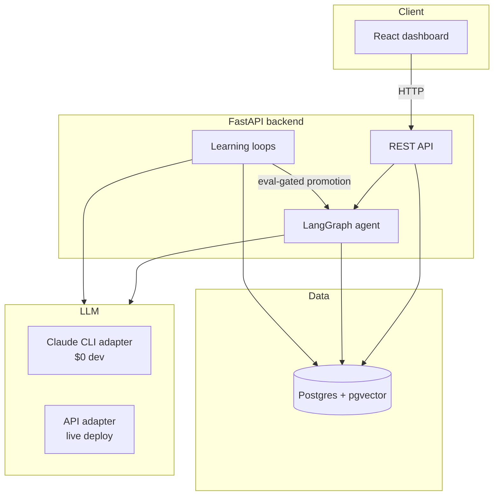
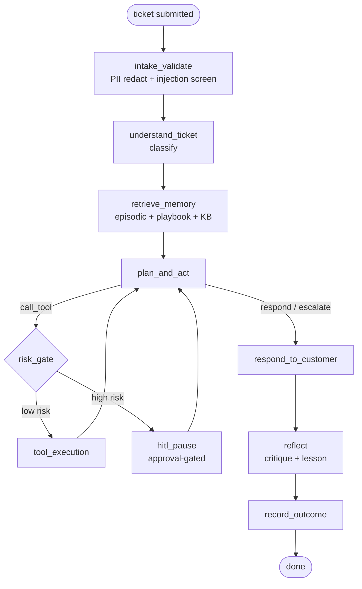
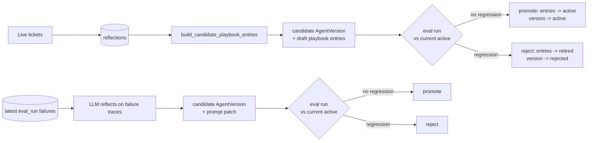

# Architecture

## System overview

## Agent state machine

## Two learning loops

Both are gated by the same frozen eval set before touching the live
`active_agent_version` — this is what prevents a bad reflection or a bad
prompt rewrite from silently degrading the agent.

## Data model

Key tables (see `backend/app/db/models.py` for full columns):

- **tickets / ticket_messages / tool_calls / approvals** — one support
  interaction and everything the agent did during it.
- **episodic_memories / playbook_entries** — pgvector-indexed; episodic
  memories are raw past-ticket summaries, playbook entries are the
  *promoted* lessons distilled from them.
- **reflections** — the QA critique + proposed lesson written after every
  ticket; the reflection loop's raw material.
- **agent_versions / prompt_versions** — one row per generation
  (`candidate` → `active`/`rejected` → `retired`), with the exact prompt
  patch (if any) that generation is running.
- **eval_set_cases / eval_runs / eval_results** — the frozen eval set and
  every scored run against it, versioned by `agent_version_id` so the
  dashboard can chart score vs. generation.
- **cost_ledger** — per-ticket/per-eval-run token and cost accounting.

## LLM provider abstraction

`app/llm/base.py` defines `LLMAdapter` (`complete`, `embed`,
`count_tokens`). Two implementations satisfy it:

- **ClaudeCLIAdapter** (default, `LLM_PROVIDER=claude_cli`) shells out to the
  local `claude` CLI in non-interactive JSON mode (`-p --output-format
  json --tools "" --json-schema ...`), so development runs at $0 marginal
  cost against an existing Claude subscription. Embeddings fall back to a
  local `sentence-transformers` model since the CLI has no embeddings
  endpoint.
- **APIAdapter** (`LLM_PROVIDER=api`) wraps `litellm.completion()` for a real
  Anthropic/OpenAI API call, used for the live deploy.

Agent/graph code depends only on the `LLMAdapter` interface — swapping
providers is one environment variable, not a code change.

## Guardrails

- **Input validation**: `intake_validate` redacts PII (email/phone/card
  patterns) before anything is persisted or embedded, and flags
  prompt-injection heuristics on the raw customer message.
- **Untrusted-content wrapping**: customer messages, retrieved memories, and
  KB articles are all delimiter-wrapped (`<untrusted_...>`) with an explicit
  instruction not to follow directives found inside them — tested directly
  by the `adversarial` eval category.
- **HITL approval gate**: `risk_gate` looks up each requested tool's risk
  level from a static policy (`app/agent/guardrails/risk_policy.py`); high-risk
  actions (refund, cancel) always create a real `Approval` row before
  executing (see "Known limitations" below for the Phase-1 stub caveat).
- **Cost/iteration caps**: `app/agent/guardrails/cost_cap.py` bounds tokens,
  metered cost, and tool-call iterations per ticket; a breach forces
  escalation to a human rather than silently truncating.

## Known limitations (by design, not oversight)

- **HITL is synchronous in this build.** `hitl_pause` creates a real
  `Approval` + `ToolCall(pending_approval)` row, then auto-resolves it
  (`reviewer="phase1_auto_stub"`) so the eval harness and traffic simulation
  can run unattended end-to-end. A real deployment would instead pause the
  LangGraph run (via its checkpointer) and resume on a human's
  `POST /approvals/{id}/decision` — the data model and API already support
  this; only the resume wiring is stubbed.
- **hallucination_score is null.** Deterministic + tool-call scoring is
  real; an LLM-judge hallucination metric (DeepEval/Ragas) is the natural
  next addition to `app/evals/metrics.py`.
- **Eval set is 19 cases, not 60–100.** Enough to produce a real,
  varied baseline and a genuine promote/reject signal; expanding it (more
  `app/evals/eval_set/v1/*.yaml` files) directly increases confidence
  without any code changes.

## Deployment

**Local dev** (default, $0 cost): Postgres+pgvector via Homebrew or Docker,
backend run on the host (needs the authenticated `claude` CLI on PATH),
frontend via `npm run dev` (proxies `/api` to `localhost:8000`).

**Containerized / live deploy**: `infra/docker-compose.yml` builds backend
and frontend from their Dockerfiles against a `pgvector/pgvector` Postgres
container — requires `LLM_PROVIDER=api` since the CLI adapter has no
authenticated session inside a container. Railway deploy (`infra/railway.toml`)
does the same split against a managed Postgres plugin. In both cases, going
live is **only an environment variable change** (`LLM_PROVIDER=api` +
`ANTHROPIC_API_KEY`) — no agent code changes, which is the actual point of
the adapter abstraction.
